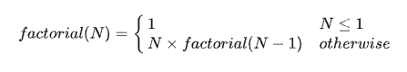

## Day 09: Recursion 3

### Task
Complete the factorial function in the editor below. Be sure to use recursion.

- Recursive Method for Calculating Factorial

    

factorial has the following paramter:
- int n: an integer

Returns
- int: the factorial of n

Note: If you fail to use recursion or fail to name your recursive function factorial or Factorial, you will get a score of 0.

### Input Format

A single integer,  (the argument to pass to factorial).

### Constraints
- 2 <= n <= 12
- Your submission must contain a recursive function named factorial.

### Sample Input

3

### Sample Output

6

### Solution
```js
'use strict';

const fs = require('fs');

process.stdin.resume();
process.stdin.setEncoding('utf-8');

let inputString = '';
let currentLine = 0;

process.stdin.on('data', function(inputStdin) {
    inputString += inputStdin;
});

process.stdin.on('end', function() {
    inputString = inputString.split('\n');

    main();
});

function readLine() {
    return inputString[currentLine++];
}

/*
 * Complete the 'factorial' function below.
 *
 * The function is expected to return an INTEGER.
 * The function accepts INTEGER n as parameter.
 */

function factorial(n) {
    if (n === 0 || n === 1) {
        return 1;
    }
    
    // Recursive case: n * factorial(n-1)
    return n * factorial(n - 1);
}

function main() {
    const ws = fs.createWriteStream(process.env.OUTPUT_PATH);

    const n = parseInt(readLine().trim(), 10);

    const result = factorial(n);

    ws.write(result + '\n');

    ws.end();
}


```